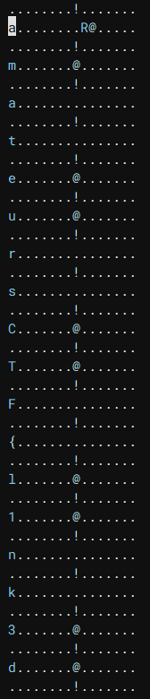

# CSCE221-Data Structures and Algorithms

## Author: flocto

**Solves:** 27

**Points:** 485

---

I was doing some homework for my Data Structures and Algorithms class, but my program unexpectedly crashed when I entered in my flag.
Could you help me get it back?

Here's the coredump and the binary, I'll even toss in the header file. Can't give out the source code though, how do I know you won't cheat off me?

---

**Provided Files:**

- [csce221.tar.gz](./csce221.tar.gz)

## Solution
First, opening up the `main` binary in a decompiler, there are only three important functions. (I used Binja here but any should work).
```c
00401196 int32_t* list_init(int32_t* arg1, char* arg2, int32_t arg3)
{
    char* rax = malloc(0x10);
    *(int8_t*)rax = *(int8_t*)arg2;
    *(int64_t*)(rax + 8) = 0;
    char* var_18 = rax;
    for (int32_t var_1c = 1; var_1c < arg3; var_1c = (var_1c + 1))
    {
        *(int64_t*)(var_18 + 8) = malloc(0x10);
        var_18 = *(int64_t*)(var_18 + 8);
        *(int8_t*)var_18 = arg2[((int64_t)var_1c)];
        *(int64_t*)(var_18 + 8) = 0;
    }
    *(int64_t*)((char*)arg1 + 8) = rax;
    *(int32_t*)arg1 = arg3;
    return arg1;
}
0040124c uint64_t list_mix(int32_t* arg1)
{
    void* var_20 = *(int64_t*)((char*)arg1 + 8);
    void* var_18 = *(int64_t*)(*(int64_t*)((char*)arg1 + 8) + 8);
    int32_t rax_6 = *(int32_t*)arg1;
    int32_t var_28 = 1;
    uint64_t rax_15;
    while (true)
    {
        rax_15 = ((uint64_t)var_28);
        if (rax_15 >= rax_6)
        {
            break;
        }
        int64_t rax_10 = (var_20 ^ *(int64_t*)((char*)var_18 + 8));
        var_20 = var_18;
        var_18 = *(int64_t*)((char*)var_18 + 8);
        *(int64_t*)((char*)var_20 + 8) = rax_10;
        var_28 = (var_28 + 1);
    }
    return rax_15;
}

004012cc int32_t main(int32_t argc, char** argv, char** envp)
{
    setbuf(stdout, nullptr);
    int32_t rax_3;
    if (argc == 2)
    {
        char* rax_5 = argv[1];
        list_init(&list, rax_5, strlen(rax_5));
        list_mix(&list);
        rax_3 = 0;
    }
    else
    {
        printf("Usage: %s <string>\n", *(int64_t*)argv);
        rax_3 = 1;
    }
    return rax_3;
}
```

If you analyze the `main` binary, you'll notice that it was compiled with `-no-pie`.
```
$ checksec main
Arch:     amd64-64-little
RELRO:    Partial RELRO
Stack:    No canary found
NX:       NX enabled
PIE:      No PIE (0x400000)
```

This means that the coredump has these functions at the same location as well. Visiting main.coredump in a decompiler, we can see that at 0x004012cc, the same location as main, we have main in the coredump.

```c
004012cc  int64_t sub_4012cc(int32_t arg1, int64_t* arg2)
{
    sub_401080(data_404050, 0);
    int64_t rax_4;
    if (arg1 == 2)
    {
        char* rax_6 = arg2[1];
        sub_401196(&data_404060, rax_6, sub_401070(rax_6));
        sub_40124c(&data_404060);
        rax_4 = 0;
    }
    else
    {
        sub_401090(&data_402004, *(int64_t*)arg2);
        rax_4 = 1;
    }
    return rax_4;
}
```

This is important because the pointers inside main here actually point to the real list that stores the flag.

So all we have to do is visit 0x404060:
```
00404060: 1d 00 00 00 00 00 00 00 a0 52 40 00 00 00 00 00  .........R@.....
```
And we have the pointer to our first node!
```
004052a0: 61 00 00 00 00 00 00 00 c0 52 40 00 00 00 00 00  a........R@.....
```
Looking at contigous memory blocks from here, we can see the flag spelled out, since no memory was allocated between `malloc` calls, so all nodes are next to each other in memory.



Full flag: `amateursCTF{l1nk3d_bY_4n_xor}`
